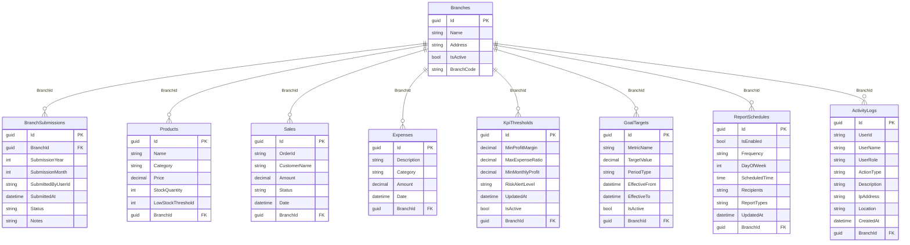

# ERD (Business-Only, Planned + Implemented)

Scope for final documentation:
- Includes business-domain tables only.
- Excludes ASP.NET Identity/framework tables.

## Notes
- This ERD is aligned with [schema.sql](schema.sql).
- Existing implemented transaction tables remain unchanged.
- Added admin-process and monitoring tables to match the planned system flow.
